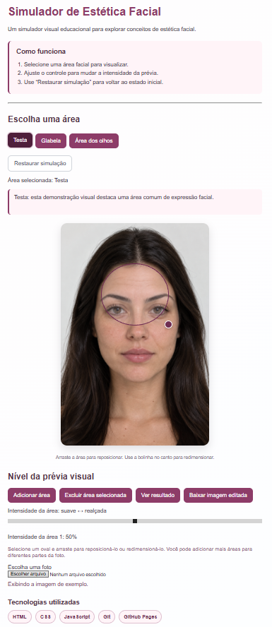

# Projeto experimental: Simulador de Estética Facial

Um simulador visual educacional para explorar, de forma interativa, conceitos de estética facial em uma imagem.

> Este é meu primeiro projeto prático de desenvolvimento web, criado como parte do meu processo de aprendizado com HTML, CSS, JavaScript, Git e GitHub Pages.

> Projeto demonstrativo: não oferece aconselhamento médico, recomendações de tratamento, orientação sobre injeções ou garantia de resultados clínicos.

## Demonstração



Acesse a versão publicada:

**[Abrir o simulador](https://brenojj-08.github.io/aesthetic-face-simulator/)**

## Funcionalidades

- Controle de textura natural da área suavizada
- Presets de suavização: suave, natural e intenso
- Ajustes gerais de brilho, contraste e saturação
- Presets rápidos de foto
- Botão para restaurar ajustes gerais
- Comparador interativo antes/depois
- Processamento local da imagem no navegador
- Layout em duas colunas no computador, com controles visíveis durante a edição

## Como usar

1. Envie uma imagem em PNG, JPG/JPEG ou WebP.
2. Escolha uma área predefinida — testa, glabela ou área dos olhos — ou clique em **Adicionar área**.
3. Arraste e redimensione o oval sobre a região desejada.
4. Ajuste a suavização e a preservação de textura da área selecionada.
5. Use os presets de suavização, se desejar.
6. Em **Ajustes gerais**, altere brilho, contraste e saturação ou escolha um preset de foto.
7. Clique em **Gerar visualização local** para comparar antes e depois.
8. Clique em **Baixar imagem em PNG** para exportar o resultado.

## Tecnologias

- HTML5
- CSS3
- JavaScript
- Canvas API
- Git e GitHub
- GitHub Pages

## Executar localmente

Clone o repositório:

```bash
git clone [https://github.com/Brenojj-08/aesthetic-face-simulator.git](https://github.com/Brenojj-08/aesthetic-face-simulator.git)
```

Depois:

1. Abra a pasta do projeto no Visual Studio Code.
2. Abra o arquivo `index.html` com a extensão Live Server.
3. Acesse o endereço local exibido pelo Live Server.

## Estrutura do projeto

```text
.
├── index.html
├── style.css
├── script.js
├── face-model.jpg.png
└── README.md
```

## Observações

- O processamento é executado localmente no navegador.
- As imagens enviadas não são enviadas para um servidor por esta versão do projeto.
- Ao carregar uma nova foto, os ajustes gerais começam em zero.
- O download é gerado em PNG e inclui os ajustes de foto e a suavização aplicada.
- A ferramenta é uma simulação visual educacional e não representa resultado clínico.

## Autor

Desenvolvido como projeto de interface web interativa.

## Sobre o projeto

O Simulador é meu primeiro projeto e é uma ferramenta educacional de visualização
local desenvolvida com HTML, CSS, JavaScript e Canvas API. 

A aplicação permite adicionar, mover e redimensionar áreas sobre uma imagem,
ajustar a intensidade da prévia, comparar visualmente o antes e depois e
exportar a imagem resultante em PNG, a ideia é auxiliar a fazer edições sútis 
para reduzir marcas de expressão no rosto e edições minimalistas na imagem.

As imagens são processadas localmente no navegador nesta versão. A integração
com IA generativa está planejada como uma evolução futura do projeto.

> Aviso: esta aplicação é exclusivamente educacional e não oferece diagnóstico,
> recomendação de tratamento, orientação médica ou garantia de resultados.
